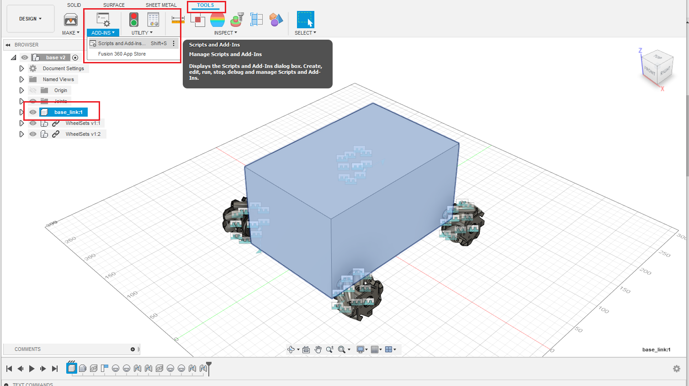
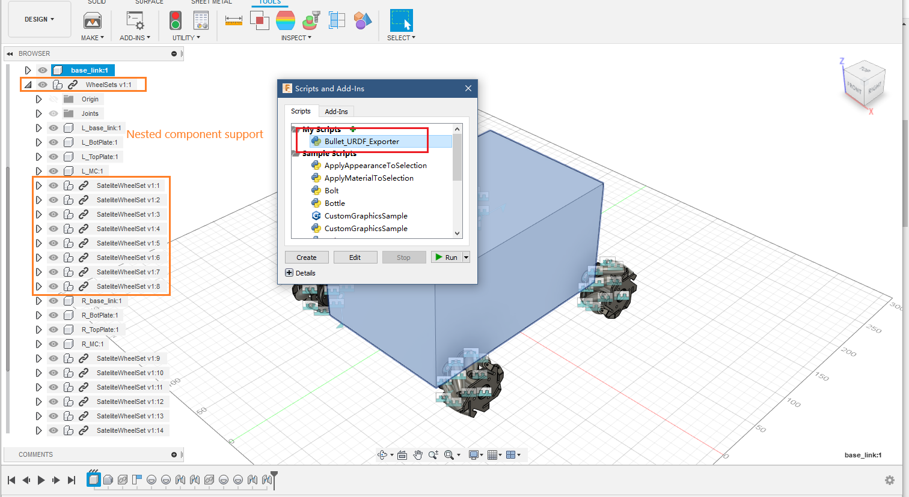
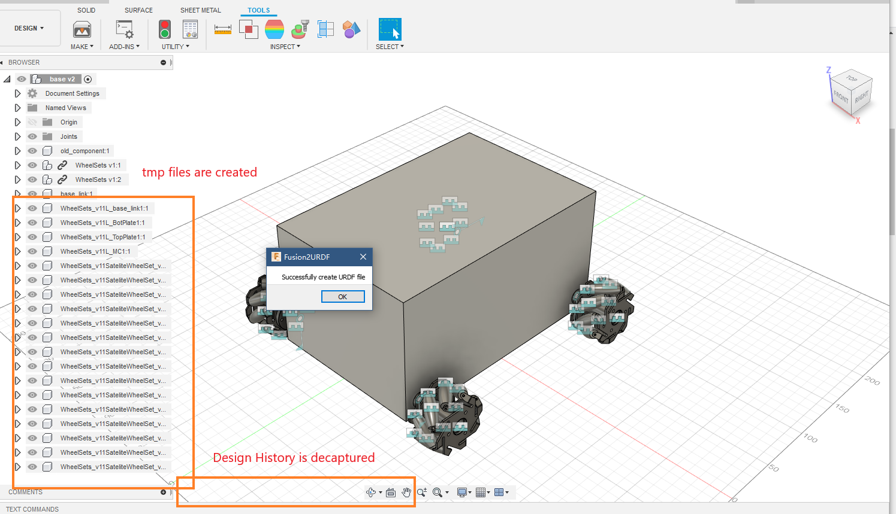
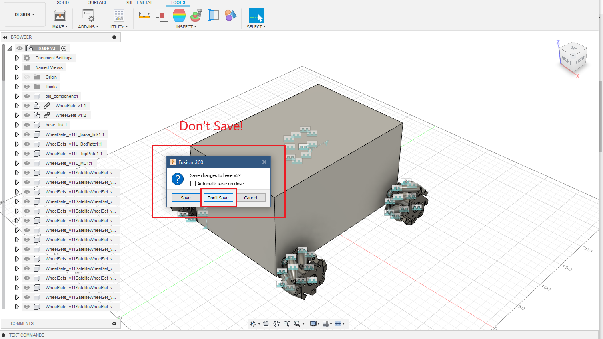
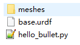
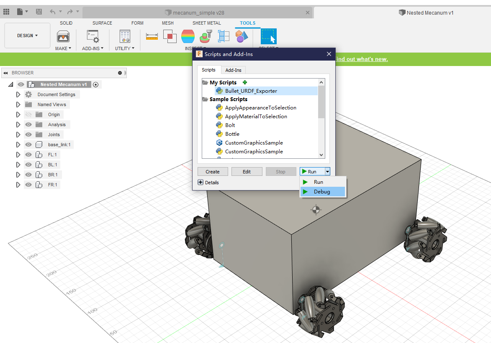

# Fusion2Pybullet

简体中文 | [English](README.md)

基于 [@syuntoku14/fusion2urdf](https://github.com/syuntoku14/fusion2urdf) 开发

### 这个脚本是干什么的？

这是一个专门用导出可用于从PyBullet的urdf文件的Fusion 360脚本。

P.S. 当前仅支持基本的“旋转”，“刚性”和“滑块”关节。并且我不打算继续加入刚性组和其他类型的关节的支持。

这个脚本会导出

* 模型的.urdf 文件
* 相关的.stl 文件
* 一个Python示例 hello.py, 用于将模型加载到PyBullet中

---

03/03/2021: 同步原 repo 的 xyz 计算方式  commit `d2e754086f092ac81c481a0c3862e3cecb1f4dfe` in [syuntoku14/fusion2urdf](https://github.com/syuntoku14/fusion2urdf/commit/d2e754086f092ac81c481a0c3862e3cecb1f4dfe)

- 如果你的模型有旋转轴错位的问题请尝试一下这个新版本
- 问题详见 [于此](https://forums.autodesk.com/t5/fusion-360-api-and-scripts/difference-of-geometryororiginone-and-geometryororiginonetwo/m-p/9837767)

03/27/2020 更新2: 补充了一个脚本 **Joint2Graphviz** 用以检查模型结构。（用法：先运行Joing2Graphviz并查看关节结构，确认无误后再运行此脚本）

03/27/2020 更新1: 加入“不捕获设计历史记录”，这可以修复一部分的导出问题。 参见 [Developer Notes](https://github.com/yanshil/Fusion2Pyblluet/wiki/Developer-Notes)

**03/25/2020: 支持嵌套组件的导出(原repo并不支持此项)**


### Fusion Add-in
通过工具->插件将此脚本添加到Fusion 360中





#### 使用此脚本之前

1. 其他一些避免Error的注意事项：
   1. 将Fusion360语言首选项更改为英语 (从而默认关节名改为英文单词)
   2. 将任何全角符号重命名为半角符号 (比如 `。` and `（）`)
2. 设置好`base_link`
3. 一个重要建议: 先运行 [**Joint2Graphviz**](https://github.com/yanshil/Joint2Graphviz) 来检查一遍组装的结构！
4. 检查一下单位是否为mm。如果你设置的是其他单位，那在导出stl fils时需要手动调整一下scale. [看看FAQ](#faq)

#### 举个栗子 Fusion 360：

1. 检查下列事项

- [x] 单位得是mm

- [x] 有一个 base_link （这个一般就是模型的root_node）

- [x] 用于导出的文件若有外部文件链接会产生问题。所以你需要对所有的外部链接部件进行“右键-断开链接”的操作。一定要记得先存档哦！

- [x] 检查零部件和联结名称 (语言首选项改回英语)

- [x] **重要！联结一定得设置正确！不然会有各种奇怪的错误跳出来。。。** 

	* 另一个脚本就是干这个的: **[Joint2Graphviz](https://github.com/yanshil/Joint2Graphviz) ** 将生成可用于Graphviz的txt文件. 将生成的txt的内容复制到 [WebGraphviz](http://www.webgraphviz.com/) 可以生成相应的关节关系图. 通常来讲，正确的模型生成的图应该是一个DAG, 并且`base_link`是唯一的根 (root node).
	
	* 另一个注意事项：在Fusion 360中，单击'J'进行组件联结的时候，**部件1是child 而部件2是 parent**. 举个例子, 如果你要组装一个四轮小车，呐么在联结轮子和车体的时候车轮应该是联结里的部件1， 车体(此情况下是`base_link`)应该是联结里的部件2

	* 以下是一个四轮车例子, 如果你希望你的的urdf如下所示`check_urdf simple_car.urdf`, 那你组装四个轮子的时候 BL, BR, FL, FR 都应该是部件1， base_link 是部件2.
	```
    robot name is: simple_car
	  ---------- Successfully Parsed XML ---------------
	  root Link: base_link has 4 child(ren)
	      child(1):  BL_1
	      child(2):  BR_1
	      child(3):  FL_1
	      child(4):  FR_1
	```

2. 运行脚本并选择存储位置
    * P.S.运行脚本后，**不要保存**文件！ DesignType会被设为“直接模式”，并会生成一些临时组件。这些更改你是肯定不会想要的。所以不要保存！如果不小心保存了记得回退。
   * 
   * 
   * 
   
3. 好啦，可以跑 `python hello_bullet.py` 试试啦!

## FAQ

###  出现Error时该怎么办？

* Bugs are usually  caused by wrongly set up joints relationships
* Nest-component support might also lead to undocumented bugs. So remove the nesting structure helps a lot.

我尝试了蛮多方法，但是导致错误的关节还是很难精准定位到，所以该脚本仍然无法优雅地显示警告和错误。因此如果你找不出模型出了什么问题，则可以试下这些操作：

1. 确保正确设置了每个关节 (parent and child 的关系，建议通过 Joint2Graphviz的DAG检查一下). 如果还是不行的话 ---> 
2. 重新整理设计图，拆开嵌套组件重新组装. 如果还是不行的话 --->  
3. 尝试使用稳定版 [Branch: stable](https://github.com/yanshil/Fusion2Pyblluet/tree/stable).
4. 试一下Fusion 360 的 debug mode，看看究竟出了什么问题 

### 怎样检查部件联结是不是搞对了哩？

参见 [Joint2Graphviz](https://github.com/yanshil/Joint2Graphviz)

### 如果我的默认单位不是mm呢？

那么你要改一下这部分代码了。`Bullet_URDF_Exporter/core/Link.py`. 搜 `scale`

（如果你发现其他地方也需要改，别忘了ping我一下，有可能有遗漏。。。）

```
        # visual
        visual = SubElement(link, 'visual')
        origin_v = SubElement(visual, 'origin')
        origin_v.attrib = {'xyz':' '.join([str(_) for _ in self.xyz]), 'rpy':'0 0 0'}
        geometry_v = SubElement(visual, 'geometry')
        mesh_v = SubElement(geometry_v, 'mesh')
        mesh_v.attrib = {'filename': self.repo + self.name + '.stl','scale':'0.001 0.001 0.001'} ## scale = 0.001 means mm to m. Modify it according if using another unit
        material = SubElement(visual, 'material')
        material.attrib = {'name':'silver'}
        
        # collision
        collision = SubElement(link, 'collision')
        origin_c = SubElement(collision, 'origin')
        origin_c.attrib = {'xyz':' '.join([str(_) for _ in self.xyz]), 'rpy':'0 0 0'}
        geometry_c = SubElement(collision, 'geometry')
        mesh_c = SubElement(geometry_c, 'mesh')
        mesh_c.attrib = {'filename': self.repo + self.name + '.stl','scale':'0.001 0.001 0.001'} ## scale = 0.001 means mm to m. Modify it according if using another unit
        material = SubElement(visual, 'material')
```
